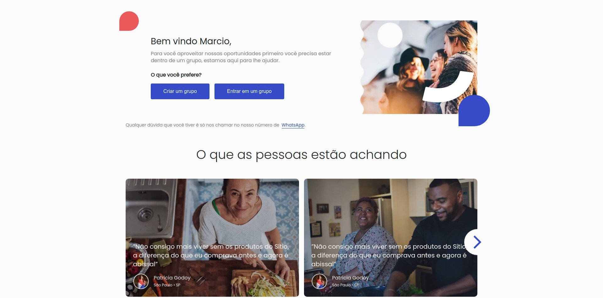

<h1 align="center">
  
</h1>

<h3 align="center">
  Desafio Zapt - Edu Souza o/
</h3>

<blockquote align="center">“Os melhores momentos na vida são como os arcos-íris: aparecem quando você menos espera.”</blockquote>

<h4 align="center">
  Repositório - Processo seletivo da Zapt
</h4>

<br/>

<p align="center">
  <a href="https://github.com/EduSouza-programmer"    target="_blank">
    
  </a>&nbsp;
  <a href="https://edusouza-programmer.github.io/" target="_blank">
    
  </a>&nbsp;
  <a href="LICENSE" >
    
  </a>
</p>

<p align="center">
  <a href="#rocket-Sobre-o-curso">Sobre o processo</a>&nbsp; &nbsp; |&nbsp; &nbsp; 
  <a href="#postbox-Entrega"">Entrega</a>&nbsp; &nbsp; |&nbsp; &nbsp; 
  <a href="#unlock-Licença">Licença</a>
</p>

## :rocket: Sobre o processo

#### Desafio Zapt

Foi uma ótima experiência esse teste seletivo, confesso que fiquei um pouco nervoso pela expectativa da avaliação do Willian Justen, mas fui ficando mais calmo depois as coisas foram fluindo :smile:. Espero que atenda as expectativas e desejo boa sorte a todos o/.

#### Screenshots:

<p align=center >
   &nbsp; &nbsp; 
  
</p>

## :postbox: Entrega

Aqui estão as instruções da avaliação do processo seletivo, [link]("./instructions/Readme.md")
#### Concluido :clipboard:

Todo projeto foi estruturado usando kanban aqui mesmo na aba projects github.
Você pode acessar [aqui](https://github.com/EduSouza-programmer/challenge_zapt-Edu_Souza/projects/1).

Para executar o projeto basta seguir os passos abaixo

1. Clone o repositório e abra a pasta dele:

```shell
$ git clone https://github.com/EduSouza-programmer/challenge_zapt-Edu_Souza && cd desafio-zapt
```

2. Instale as dependência com `yarn` ou `npm`:

```shell
$ yarn install
```

3. Depois de clonar e instalar o repositório, rode o projeto em `localhost`:

```shell
$ yarn dev
```

<br/>

E só pra não esquecer srsrs, todo o projeto foi feito com storybook! :smile: 
Para executar, depois que concluir os passos acima, siga com: 

```shell
$ yarn storybook
```

### Considerações finais

Mas uma vez quero agradecer a oportunidade, principalmente ao professor Willian Justen, graças aos seus cursos tenho adquirido conhecimentos mais avançados que me dão maturidade na minha jornada de desenvolvedor web. :rocket:

<br/>

## :unlock: Licença

Este projeto está licenciado sob a Licença MIT - consulte [LICENSE](https://opensource.org/licenses/MIT) para maiores detalhes.
